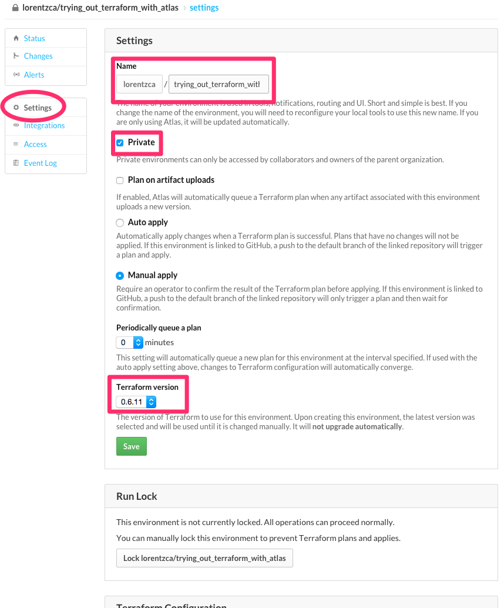
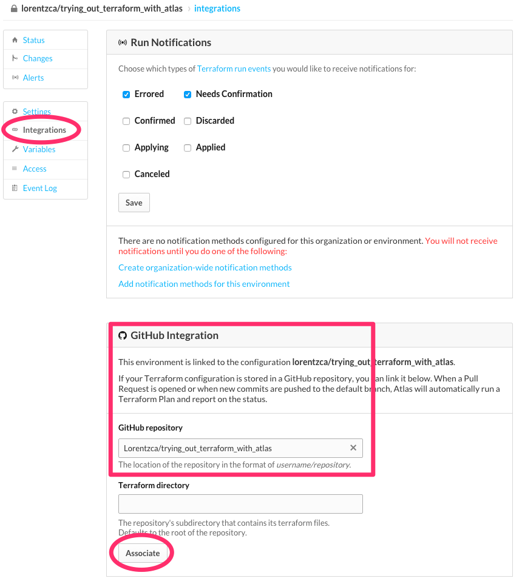
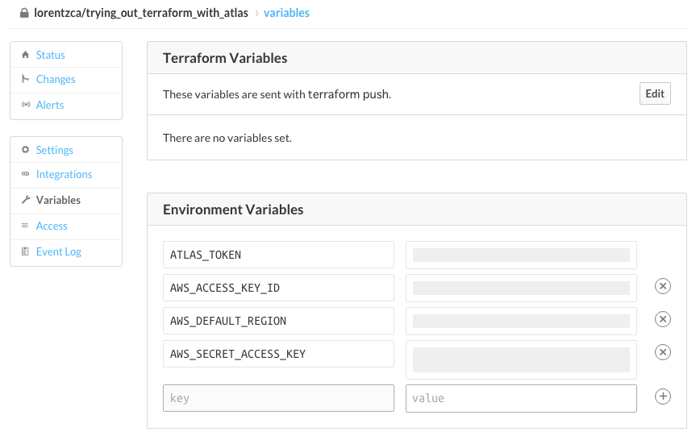
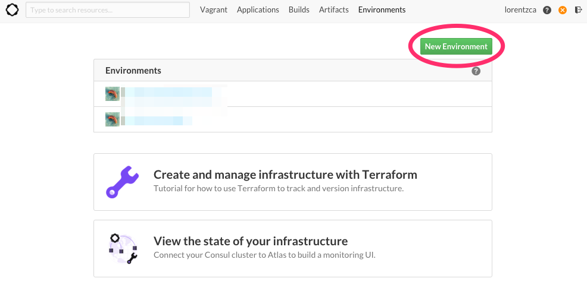
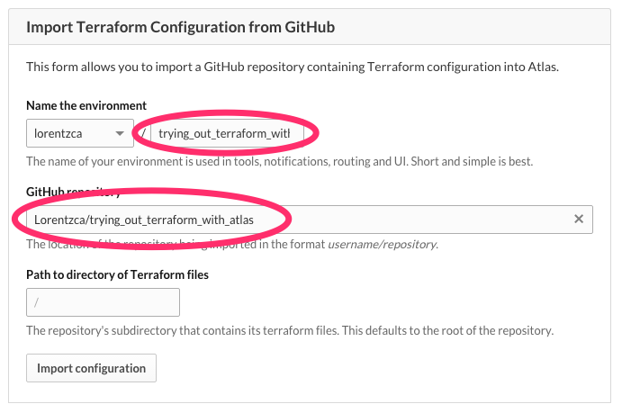
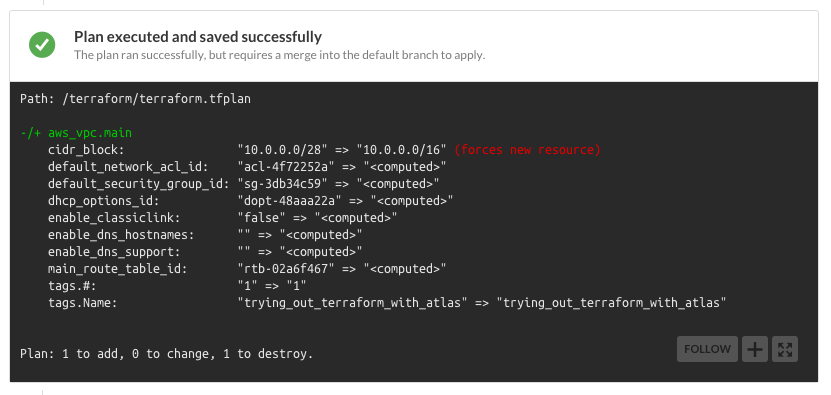

# trying out terraform with atlas and github

terraformのインテグレーションをatlasとgithubで試した記録

## github

```
cd trying_out_terraform_with_atlas
git init .
git add .
git commit -m '1st commit'
```

githubにリポジトリ作っておく

```
git remote add origin git@github.com:Lorentzca/trying_out_terraform_with_atlas.git
git push -u origin master
```

## atlasトークンを取得する

<https://atlas.hashicorp.com/settings/tokens>


## 必要な環境変数の設定

- ATLAS_TOKENは必須
- ほかはterraformで使うプロバイダによって適宜変える

```bash
export ATLAS_TOKEN="1a2b3c4d"
export AWS_ACCESS_KEY_ID="1234abcd"
export AWS_SECRET_ACCESS_KEY="1234ABCD"
export AWS_DEFAULT_REGION="ap-northeast-1"
```

## terraformの状態管理をatlasに指定する

```bash
terraform remote config -backend-config "name=<atlas-uername>/trying_out_terraform_with_atlas"
```

atlasに管理ページが作成される


## integrationsの設定をする

### atlas側の設定をする

- terraformのplan結果に何かしら機密情報が含ま得れる場合もあるかもしれない(RDSのパスワードとか)のでプライベートにしておいたほうが良さそう(デフォルトでプライベートになっている)
- terraformのバージョン指定もしておく



- 案内にある通りatlasの環境とterraformをリンクさせる(上の画像の続きにある)


```
terraform push -name <atlas-uername>/trying_out_terraform_with_atlas
```

### githubのリポジトリに接続する

- terraform directoryはtfファイルがリポジトリのroot以下に無い場合(`terraform/main.tf`とか)指定する




## 適当に何かコミットする

atlasでplanが実行される


環境変数が足りなくて失敗！


ステータスがPRに反映される


### Atlasに環境変数の設定

variablesの設定から行う


諸々必要な環境変数を埋めた



### 再度コミット

plan成功


PRのステータスもグリーンになった


## メモ

### terraformの状態管理をatlas以外にした場合

terraformのバックエンドをs3にしてみる

- [terraformの状態管理をatlasに指定する](https://github.com/Lorentzca/trying_out_terraform_with_atlas#terraformの状態管理をatlasに指定する)から分岐

```
terraform remote config -backend=S3 -backend-config="bucket=terraform-20160222" -backend-config="key=terraform.tfstate"
```

当然この時点でまだatrasに管理ページは作られない  
新規にenvironmentを作成する





この時点でgithubの接続と、terraformのatlasへのリンクが完了する

- `terraform remote config -backend-config "name=<atlas-uername>/trying_out_terraform_with_atlas"`した場合最初からリンクされないのは、atlasをterraformのバックエンドとしてしか指定していないから？

後は同じように環境変数を設定しておく

apply後設定を変更してみると…

- ローカル(s3参照)だと差分があるが

```
$ terraform plan
Refreshing Terraform state prior to plan...

aws_vpc.main: Refreshing state... (ID: vpc-01e89a64)

The Terraform execution plan has been generated and is shown below.
Resources are shown in alphabetical order for quick scanning. Green resources
will be created (or destroyed and then created if an existing resource
exists), yellow resources are being changed in-place, and red resources
will be destroyed.

Note: You didn't specify an "-out" parameter to save this plan, so when
"apply" is called, Terraform can't guarantee this is what will execute.

-/+ aws_vpc.main
    cidr_block:                "10.0.0.0/28" => "10.0.0.0/16" (forces new resource)
    default_network_acl_id:    "acl-f976219c" => "<computed>"
    default_security_group_id: "sg-21bb4445" => "<computed>"
    dhcp_options_id:           "dopt-48aaa22a" => "<computed>"
    enable_dns_hostnames:      "" => "<computed>"
    enable_dns_support:        "" => "<computed>"
    main_route_table_id:       "rtb-d4a2f0b1" => "<computed>"
    tags.#:                    "1" => "1"
    tags.Name:                 "trying_out_terraform_with_atlas" => "trying_out_terraform_with_atlas"


Plan: 1 to add, 0 to change, 1 to destroy.
```
- atlas上では新しく作成したように見えている(= s3の情報見えていない)


バックエンドをatlasにした場合

- ローカル(atlas参照)と一致する

```
$ terraform plan
Refreshing Terraform state prior to plan...

aws_vpc.main: Refreshing state... (ID: vpc-12ef9d77)

The Terraform execution plan has been generated and is shown below.
Resources are shown in alphabetical order for quick scanning. Green resources
will be created (or destroyed and then created if an existing resource
exists), yellow resources are being changed in-place, and red resources
will be destroyed.

Note: You didn't specify an "-out" parameter to save this plan, so when
"apply" is called, Terraform can't guarantee this is what will execute.

-/+ aws_vpc.main
    cidr_block:                "10.0.0.0/28" => "10.0.0.0/16" (forces new resource)
    default_network_acl_id:    "acl-4f72252a" => "<computed>"
    default_security_group_id: "sg-3db34c59" => "<computed>"
    dhcp_options_id:           "dopt-48aaa22a" => "<computed>"
    enable_dns_hostnames:      "" => "<computed>"
    enable_dns_support:        "" => "<computed>"
    main_route_table_id:       "rtb-02a6f467" => "<computed>"
    tags.#:                    "1" => "1"
    tags.Name:                 "trying_out_terraform_with_atlas" => "trying_out_terraform_with_atlas"


Plan: 1 to add, 0 to change, 1 to destroy.
```



## まとめ

- terraformの状態の保存先をs3にしてもatlasにしてもgithubと接続してplan実行自体は出来る
- しかし、実際の環境との差分は、terraformの状態の保存先をatlasにしないと見れない
	- atlas側の`/terraform/terraform.tfplan`というファイルとの差分を見ているからと思われる(s3バックエンドにしてもs3を参照してくれない)
- terraformの状態の保存先をatlasにしないと実質使えない
